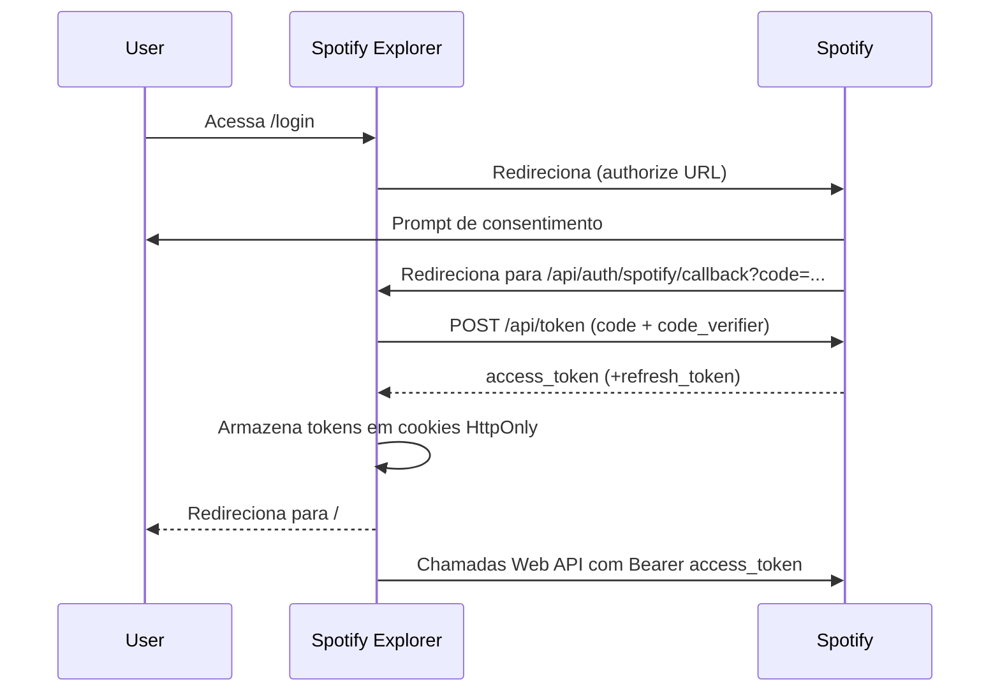

# Spotify Explorer – Authorization Flow

## 1. Spotify Web API Overview

> Referência oficial: [Spotify Web API Authorization Guide](https://developer.spotify.com/documentation/web-api/concepts/authorization)

A Spotify Web API utiliza o fluxo **Authorization Code com PKCE** para apps client-side. O processo ocorre em três etapas principais:

1. **Iniciação** – o app gera um `code_verifier` aleatório, deriva um `code_challenge` e redireciona o usuário para `https://accounts.spotify.com/authorize` informando `client_id`, `redirect_uri`, `scope`, `code_challenge` e `code_challenge_method=S256`.
2. **Consentimento** – o usuário autentica na Spotify e concede permissões. A Spotify redireciona o usuário para `redirect_uri`, incluindo `code` (ou `error`) na query string.
3. **Troca de código por tokens** – o servidor do app envia `code`, `code_verifier`, `client_id`, `client_secret` e `redirect_uri` para `https://accounts.spotify.com/api/token`. Se a validação for bem-sucedida, a Spotify responde com `access_token`, `refresh_token` (opcional) e `expires_in`.

Com o `access_token` válido, o app faz chamadas autenticadas para a Web API usando o header `Authorization: Bearer <token>`.

## 2. Fluxo Interno do Spotify Explorer

O projeto implementa o mesmo fluxo com rotas internas do Next.js (App Router) em `/api/auth/spotify`.

### 2.1 Preparação

- Antes de iniciar o login, `SPOTIFY_CLIENT_ID`, `SPOTIFY_CLIENT_SECRET`, `SPOTIFY_REDIRECT_URI` e `SPOTIFY_SCOPES` precisam estar definidos em `.env.local`. A função `getSpotifyEnv` (`src/features/auth/model/auth.model.ts`) valida essas variáveis.
- As Redirect URIs cadastradas na dashboard da Spotify devem incluir:
  - produção: `https://spotify-explorer-seven.vercel.app/api/auth/spotify/callback`
  - desenvolvimento: `http://127.0.0.1:3000/api/auth/spotify/callback` (e variantes como `http://[::1]:3000/...` se registradas)

### 2.2 Login Handler (`/api/auth/spotify/login`)

1. `generateCodeVerifier` cria um valor aleatório e `buildCodeChallenge` gera o hash SHA-256.
2. `setCodeVerifierCookie` guarda o verifier em cookie HttpOnly por 5 minutos.
3. `buildAuthorizeUrl` monta a URL de consentimento com `client_id`, `redirect_uri`, `scope`, `code_challenge` e `code_challenge_method`.
4. O handler faz `NextResponse.redirect(authorizeUrl)`. O usuário segue para a Spotify.

### 2.3 Callback Handler (`/api/auth/spotify/callback`)

1. Recupera `error` ou `code` da query string.
2. Busca o `code_verifier` pelo cookie (`readCodeVerifier`).
3. Se houver erro ou faltar `code`/`verifier`, define um cookie `spotify_auth_error` e redireciona para `/`.
4. Quando o `code` é válido, chama `exchangeCodeForTokens` para obter `access_token`, `refresh_token` e `expires_in`.
5. `storeTokens` grava cookies HttpOnly (`spotify_access_token`, `spotify_access_token_expires_at`, `spotify_refresh_token` se existir).
6. Limpa o cookie do verifier e redireciona o usuário para `/`.

### 2.4 Uso do Token

- Qualquer loader server-side chama `getValidAccessToken` (`src/features/auth/model/auth-server.helpers.ts`). Ele lê `spotify_access_token` e verifica expiração via `isAccessTokenExpired`.
- Se o token estiver válido, é reutilizado para formular as chamadas à Web API (ex.: `src/app/api/artists/popular/route.ts`, `src/features/user/api/get-current-user.api.ts`).
- Caso o token esteja ausente ou expirado, a função retorna `null`, provocando fallback para estados não autenticados (e eventualmente um novo login).

### 2.5 Pontos Pendentes

- **Refresh Token**: o projeto ainda não usa o `refresh_token`. Quando os cookies expiram, o usuário precisa refazer o login.
- **Armazenamento seguro**: os cookies são HttpOnly e `secure` somente em produção (`isProduction`).

## 3. Sequência Resumida

